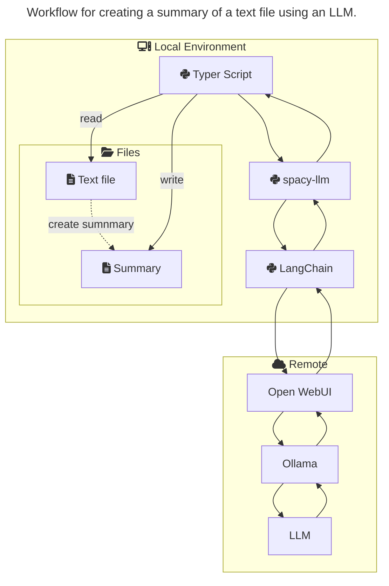

# Connect spacy-llm with OpenWebUI/Ollama

Small example project showing how to connect to an LLM hosted via OpenWebUI/Ollama using spacy-llm with LangChain.

> **Assumption**: You already have Open WebUI bundled with Ollama running and a model installed.
>
> In `openwebgui.cfg` we assume this model is [llama3.1:latest](https://ollama.com/library/llama3.1).

## Quickstart

This code snippets show you how to 1. create an python virtual environment, 2. activate it, 3. install the necessary dependencies in the environment and 4. execute the summarization script on Linux and on Windows.

**On Linux:**

```powershell
python -m venv .venv
source .venv/bin/activate
pip install -r requirements
# create .env file from .env_default
python create_summary README.md openwebui.cfg
```

**On Windows:**

```powershell
python -m venv .venv
. .\.venv\Scripts\activate
pip install -r requirements
# create .env file from .env_default
python create_summary README.md openwebui.cfg
```

> **Note**: You have to copy `.env_default` to `.env` and fill in your information on how to access your Open WebUI installation.
>
> For that you have to create an API Key in Open WebUI via **Settings > Account** (see [Authentication in OpenWeb UI documentation](https://docs.openwebui.com/getting-started/advanced-topics/api-endpoints/#authentication)).

## Task

The example task that this script solves is creating a [summary](https://spacy.io/api/large-language-models#summarization-v1) from a text based document.
SpaCy supports several other NLP related [tasks](https://spacy.io/usage/large-language-models#tasks).
But creating a summary feels very intuitive and we do not have to explain and create a lot of configuration.

## Components



### Typer

This is some overhead that is "just nice".
With [typer](https://typer.tiangolo.com/) we can easily create beautiful Python CLIs.

You do not need this if you want to use a [Jupyter Notebook](https://jupyter.org/) or another stack.

We also added [python-dotenv](https://github.com/theskumar/python-dotenv) to automagically make variables from the `.env`-file available as environment variables.

### spacy-llm

We let [spacy-llm](https://github.com/explosion/spacy-llm/) handle the overhead of converting a text and a task to an LLM suitable package.
Also parsing the response of LLMs is sometimes a challenge, especially for more complex tasks like [NER](https://spacy.io/api/large-language-models#ner) or [Span Categorization](https://spacy.io/api/large-language-models#spancat).

So with spacy-llm we basically just put our text a into spaCy document and let spacy-lllm handle the more frustrating tasks for us.

### LangChain

As spacy-llm does not have a direct integration of Ollama or Open WebUI (yet), we could [write our own model for spacy-llm](https://github.com/explosion/spacy-llm/tree/main/usage_examples#writing-your-own-model).

Or we can use the [LangChain](https://www.langchain.com/) integration of spacy-llm.

> **Note**: make sure to install a version of LangChain that is supported by spacy-llm.
>
> Otherwise spacy-llm will complain that it can not find a suitable model for your configuration.

### Open WebUI

The [Open WebUI](https://openwebui.com/) provides us with a web based interface to manage chats, models and more tools.
Whether you host it on a more powerful remote machine or your local environment depends on the hardware you have access to.

Nonetheless from a spacy-llm perspective Open WebUI is are remote service and the communication will happen via a REST API.
The REST API we will use is the REST API of Ollama.

### Ollama

The [Ollama](https://ollama.com/) project helps running and accessing several LLMs via a uniform REST API.
So basically for this setup we could ignore Open WebUI and directly use Ollama.

But besides a graphical user interface Open WebUI provides a user and access management.
This makes the bundle of Open WebUI and Ollama more attractive for teams and/or running it on remote environments.
But this makes this bundle also a little more tricky to access the protected API.

Instead of just setting an environment variable like in other REST based use-cases for spacy-llm we need to provide an authorization header with each request.
Luckily LanchChain already allows to configure a header on the Ollama Model and spacy-llm allows us to set this configuration in the pipelines configuration file.

> **Note**: In newer versions of LangChain you can not set the header directly on the model config.
>
> But you can directly [pass keyword arguments to the httpx client](https://python.langchain.com/api_reference/ollama/llms/langchain_ollama.llms.OllamaLLM.html#langchain_ollama.llms.OllamaLLM.client_kwargs) LangChain uses to communicate with the remote REST APIs.
> With this you can not only set auth parameters or headers, but also configure how SSL verification and so on should be handled.
